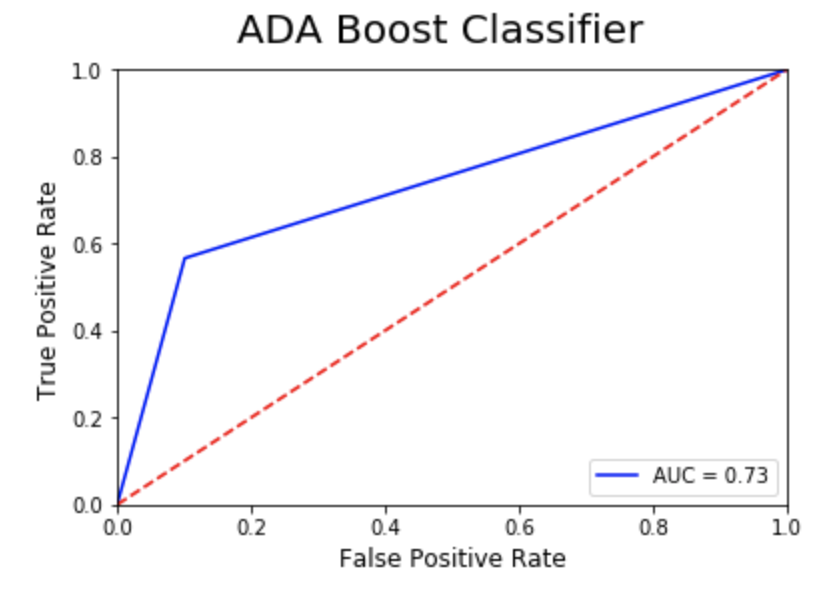
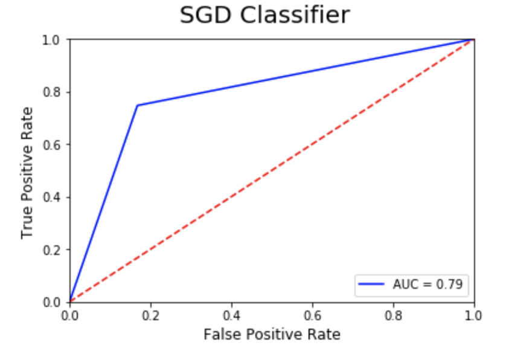

# Introduction

The wrangled dataset is used in this section to perfrom Expoloratory Data Analysis and building classifiers to predict the labels for tweets. The target variable has two values:

* 0 represents disaster 
* 1 represents no disaster

# Exploratory Data Analysis

The following inferences are drawn from the EDA:

* Keywords which are least related to disaster tweets are related to a considerable large number of non-disaster tweets.
* Keywords which are least related to non-disaster tweets are related to a considerable large number of disaster tweets.
* Keywords which are most related to non-disaster tweets DO NOT necessarily have low number of disaster tweets.
* Keywords which are most related to disaster tweets DO NOT necessarily have low number of non-disaster tweets.
* Certain words that imply a disaster in common usage such as explode,electrocute etc are keywords to more non-disaster tweets.

# Data Mining

At this step, Sklearn Pipeline is used to:

1)  Vectorize the text
2)  Compute Term Frequency- Inverse Document Farequency values
3) Fit the model on the training data

The fitted model is then used to predict the test labels. The predicted test labels are then compared to the true test labels using F score and Area under ROC curve. The result from the models are displayed in the the roc curves diagrams below.

